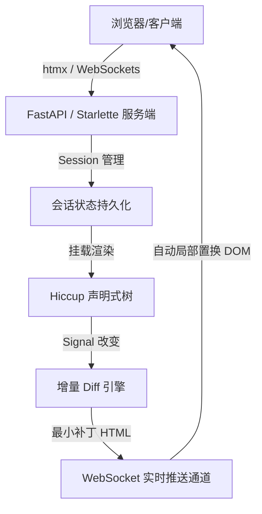

# Hiccl — 全栈反应式 Python Web 框架 🧪🥒

<p align="center">
  <strong>简体中文</strong> • <a href="README.en.md">English</a>
</p>

<p align="center">
    <a href="https://zread.ai/shiunko/hiccl" target="_blank"></a>
</p>

<p align="center">
  <strong>基于 Hiccup 声明式 DSL 表达与 Pythonic 状态序列化流动的现代化 Web 框架</strong>
</p>

<p align="center">
  <a href="#-设计理念">设计理念</a> •
  <a href="#-核心特性">核心特性</a> •
  <a href="#-快速上手">快速上手</a> •
  <a href="#-架构设计">架构设计</a> •
  <a href="#-极速离线体验">极速离线体验</a> •
  <a href="#-开发与贡献指南">开发与贡献指南</a>
</p>

> [!TIP]
> **使用 Zread 智能交互助手阅读本项目**：
> 读者可以通过点击上方的 **Ask Zread** 徽章，直接向 AI 仓库助手提出关于 `hiccl` 架构或实现细节的任何疑问。它能帮助贡献者更快上手、直接回答读者提问、减少重复 issues，让 README 更有用！

---

## 🎨 命名与设计理念

**Hiccl**（读作 `/ˈhɪk.l̩/`，“Hick-le”）是 **Hiccup** 与 **Pickle** 的灵魂结晶：

*   **Hiccup**：继承了 Clojure 的高贵血统。在 Hiccl 中，你不必编写任何 HTML 样板，全部 DOM 结构都可以用极其优雅的 Python 嵌套列表与数据结构（DSL）声明式表达。
*   **Pickle**：散发着浓郁的 Pythonic 风味。代表着组件状态（State/Signal）的自动追踪与生命周期持久化。组件的状态随连接会话建立而自动管理，并通过极速的网络传输机制实现增量更新（Diff Patch）。

**Hiccl** 让 Clojure 式极简的声明式 UI 设计与 Pythonic 的全栈反应式交互在 FastAPI 上完美绽放！

---

## ⚡️ 核心特性

*   **⚡️ 100% 声明式组件**：仅用嵌套 Python 列表（Hiccup）描述 UI，框架自动将 `on_click` 等事件绑定转化为底层的高能网络动作，没有繁琐的 AJAX/Fetch 胶水代码。
*   **🔌 双向反应式状态与便捷工厂**：基于 `Signal`（`signal`）、`ComputedSignal`（`computed`）和 `Effect`（`effect`）以及批量事务 `batch`。任何状态改变都会在服务端自动生成新的虚拟 DOM 并计算最小 Diff 补丁。
*   **🛡️ 运行时 `hiccl.spec` 契约保障**：支持 Clojure-like 声明式数据契约，无缝守卫 `@server` 方法边界；提供结构化 `explain_data` 报错，赋予 AI Agent 极佳的错误内省与报错自愈闭环能力。
*   **🔐 生产级 Redis 存储与分布式锁**：`RedisSessionStore` 支持 ConnectionPool 和指数退避重连；采用 Base64+Msgpack 高压缩率序列化并支持优雅降级；内置分布式锁悲观机制，规避高频并发状态覆写。
*   **🔀 MQTT 层级通配符总线**：`EventBus` 原生支持层级通配符订阅（`*` 匹配单层，`#` 匹配多层），在发布时自动通过高速正则缓存路由精准分发。
*   **🧩 Reagent 风格纯函数组件与单向数据流**：引入以 `@component` 装饰的纯展示层组件，支持使用 `use_signal()`、`subscribe()` 派生订阅及 `dispatch()` 进行单向数据流事件派发，实现 UI 与副作用的深度解耦。
*   **📡 Clojure-like CSP 并发管道编排**：全面支持 Pythonic `Channel`（具备背压、同步/缓冲通道及安全 close 状态）、`alts_` 公平多路多信道选择原语、`timeout` 毫秒级高精度超时通道，以及配合 EventBus 异常广播的 `@go` 后台任务调度器。
*   **🔀 Transducers 渲染管线切面中间件**：提供对 Hiccup 虚拟 DOM 树的自底向上 DFS 不可变变换器（`Transducer` 树遍历基类），内置 `LoadingTransducer`（自动按键 Loading 菊花态置换）与 `SanitizingTransducer`（日志敏感数据安全脱敏拦截器）。
*   **🎨 内置 DaisyUI & TailwindCSS**：默认集成顶级暗色调毛玻璃组件库（DaisyUI）和原子化样式（TailwindCSS），开箱即用构建极其现代、高级的用户界面。
*   **🌿 Alpine.js 客户端加速**：完全移除传统的 Hyperscript，深度整合 Alpine.js，支持以标准的 HTML 属性在浏览器端运行极速的交互渲染（如每秒 60 帧的高频计时器与毫秒级时差偏差计算）。
*   **📦 100% 离线与内网就绪（Air-gapped Ready）**：所有静态依赖（`tailwind.js`、`daisyui.css`、`alpine.js`、`htmx.js`）完全本地托管于 `static/` 目录下。无需任何互联网连接即可在隔离的物理内网高速运行。
*   **🔀 优雅的组件路由与自动导航菜单**：只需通过 `pages=menu(Counter, TwoClocks, ChatRoom)` 即可全自动生成对应的 kebab-case 格式路由路径与毛玻璃渐变顶栏导航。

---

## 🚀 快速上手

### 1. 简易计数器组件 (`examples/counter/app.py`)

Hiccl 组件非常清爽，毫无杂质：

```python
from hiccl import (
    Component,
    ComponentRegistry,
    HicclConfig,  # 全局配置依然保持极简
    create_hiccl_app,
    menu,
    server,
    signal,
)
from hiccl.hiccup import button, div, h2

registry = ComponentRegistry()


class Counter(Component):
    """极简的响应式计数器。"""

    def __init__(self, **kwargs):
        super().__init__(**kwargs)
        self.count = signal(0)

    @server
    def increment(self, step: int = 1):
        if isinstance(step, str):
            step = int(step)
        self.count.set(self.count.get() + step)

    @server
    def decrement(self, step: int = 1):
        if isinstance(step, str):
            step = int(step)
        self.count.set(self.count.get() - step)

    @server
    def reset(self):
        self.count.set(0)

    def render(self):
        count = self.count.get()
        return div(
            {"class": "card w-96 bg-base-200 shadow-xl border border-base-300 mx-auto"},
            div(
                {"class": "card-body items-center text-center"},
                h2(
                    {"class": "card-title text-3xl font-extrabold mb-4"},
                    f"Count: {count}",
                ),
                div(
                    {"class": "card-actions justify-center gap-2"},
                    button(
                        {
                            "class": "btn btn-outline btn-error",
                            "on_click": self.decrement(5),
                        },
                        "-5",
                    ),
                    button(
                        {"class": "btn btn-error", "on_click": self.decrement(1)}, "-1"
                    ),
                    button(
                        {"class": "btn btn-neutral", "on_click": self.reset}, "Reset"
                    ),
                    button(
                        {"class": "btn btn-success", "on_click": self.increment(1)},
                        "+1",
                    ),
                    button(
                        {
                            "class": "btn btn-outline btn-success",
                            "on_click": self.increment(5),
                        },
                        "+5",
                    ),
                ),
            ),
        )


# 一键自动生成路由并挂载！
app = create_hiccl_app(HicclConfig(component_registry=registry, pages=menu(Counter)))

if __name__ == "__main__":
    import uvicorn

    uvicorn.run(app, host="127.0.0.1", port=8000)
```

### 2. ⚡️ 极速开发模式 (HMR & hREPL)

Hiccl 提供了为 AI 时代与极致 DX 打造的**开发模式双子星**：DOM 级 HMR 热重载与非阻塞 hREPL 网络套接字服务器。

#### 🚀 启动开发服务器
使用全新的 `hiccl` CLI 即可一键开启带有热更新与 REPL 支持的本地开发环境：
```bash
uv run hiccl dev examples.combined_app:app --live-reload --hrepl
```

*   **`--live-reload`**：启用**状态不丢失**的 DOM 级热重载（HMR）。每当你修改并保存任何 `.py` 组件代码，Hiccl 会在不重启服务器、不重新加载网页、**100% 完整保留内存中已有的 Signal 状态**的前提下，将重新加载后的类注入 ComponentRegistry，并通过 DiffEngine 增量计算 DOM 补丁，秒级在浏览器端局部更新 UI。
*   **`--hrepl`**：在 `127.0.0.1:8998`（默认端口）启动网络 REPL 服务。
    *   **安全防御机制**：默认隔离仅绑定 localhost 接口，启动时在 stdout 打印随机生成的 **32 位强认证 Token**（可通过 `HREPL_TOKEN` 环境变量指定）。所有的 eval 记录将安全审计至 `.hrepl_audit.log` 文件中。
    *   **远程手术刀求值（Remote Surgery）**：支持标准 JSON-RPC 协议进行通信。您或 **AI Agent** 可直接连接该套接字发送包含 `await` 关键字的复杂多行 Python 语句，实时读取在线用户的 `Session` 实例、检索 Signals 链路甚至热修补类方法，极大降低了异步协作的调试成本。

---

## 🛠 架构设计

Hiccl 在架构上高度分工，每个部分各司其职，保证了全栈反应式通信的极致顺畅：



1.  **Hiccup UI 引擎**：负责将 Python 列表转化为标准 HTML。渲染时，带有 `@server` 修饰器的属性（如 `on_click`）会被智能捕捉并转化为底层的网络事件。
2.  **增量 Diff 引擎**：任何服务端的 `Signal` 状态变更触发 Effect。框架仅重新渲染脏组件，计算并提取最小补丁，以最小的数据开销实时更新客户端。
3.  **多路传输层（SSE/WebSockets）**：无缝支持高频实时状态同步。

---

## 🤖 为什么 Hiccl 天生适合 AI 时代？

在 AI Agent（如 Antigravity）与 Copilot 成为核心生产力的今天，**传统的前后端分离（React/Vue + API + Backend）开发范式正在成为 AI 编写代码的沉重枷锁**。Hiccl 从底层架构上彻底消除了这一痛点：

1. **🧩 单一语言与统一心智模型**：
   - 告别在 TypeScript (前端) 与 Python (后端) 之间的频繁上下文切换。
   - 整个应用（UI、响应式状态、事件处理器）100% 采用纯 Python 声明式编写。AI 程序员只需专注在一种语言、一个类中完成全栈功能。

2. **🔌 零 API 胶水代码，杜绝接口对不齐**：
   - 无需编写任何 REST 路由、Pydantic 序列化 Schema、Axios 抓取钩子或前端 Redux 状态管理。
   - AI 只需要调用 `self.count.set(self.count.get() + 1)`，网络传输与状态同步完全由框架自动搞定，从根本上杜绝了接口不一致导致的“AI 幻觉”与联调报错。

3. **🌿 纯数据结构声明 UI (Hiccup)**：
   - Hiccl 使用声明式的 Python 数据结构表达 DOM（Hiccup DSL），规避了 HTML/JSX 标签未闭合或缩进错乱的问题。
   - LLM 极其擅长生成结构化数据（如 Python 列表与函数嵌套）。此外，纯 Python 语法让 `mypy` / `pyright` 可以秒级进行静态类型检查，AI 能够实现高精度的“测试-报错-自愈”闭环。

4. **⚡ 极致飞速的开发与自愈反馈**：
   - 去除了前端繁琐的 Vite/Webpack 打包编译链。
   - Hiccl 组件可以直接在 Python 内存中以毫秒级运行单元测试（**140 个测试仅需 0.3 秒！**）。超高速的反馈环能让 AI Agent 在几秒内完成十几次自主迭代，达到惊人的开发成功率。

---

## 📦 极速离线体验

Hiccl 天生为企业级内网而设计。只需运行以下三合一联合应用即可预览超级炫酷的多组件自动路由与极速切换：

```bash
# 启动离线三合一演示（集成 Counter, TwoClocks, ChatRoom）
python3 examples/combined_app.py
```

### 演示亮点：
1.  **DaisyUI Chat**：进入 `/chat-room` 开启高颜值多人同步聊天。
2.  **DaisyUI Stats**：进入 `/two-clocks` 查看由 Alpine.js 驱动的毫秒级系统偏差统计图表。
3.  **完全断网测试**：你可以彻底拔掉电脑网线，你会发现导航、交互、动态刷新均毫无迟滞地正常工作，所有 JS/CSS 均完全由本地静态服务器提供。

---

## 🛠️ 开发与贡献指南

我们非常欢迎社区贡献！为了确保代码质量与一致性，请在开发前安装好我们的现代化开发工具链，并遵循以下指南。

### 📦 1. 开发工具链管理 (`mise`)

本项目推荐并支持使用 [**mise**](https://mise.jdx.dev/) 这一多语言项目管理利器。它比传统工具更快、更轻量，且能自动配置项目所需的特定版本环境与执行便捷的任务命令（Tasks）。

#### **为什么使用 mise？**
*   **统一的工具版本**：自动为您拉取并安装 `pyproject.toml` 和 `mise.toml` 中指定的 Python、Ruff、uv 等环境，无需手动切换或配置虚拟环境。
*   **强悍的任务执行**：直接通过 `mise run <task>` 执行各种日常脚本，告别冗长难记的命令行。

#### **快速安装与开启**
1.  **安装 mise**：
    *   **macOS** (Homebrew): `brew install mise`
    *   **通用安装脚本**: `curl https://mise.jdx.dev/install.sh | sh`
2.  **受信任与激活项目**：
    在项目根目录运行以下命令以加载工具：
    ```bash
    mise trust
    ```
    *(或者您也可以运行 `eval "$(mise activate bash)"` 或对应的 shell 激活命令来自动激活 `mise` 环境变量。)*

---

### 🚀 2. 本地任务与开发流程

在 `mise` 激活后，你可以使用以下预定义的高效开发任务：

| 任务命令 | 任务描述 | 对应底层指令 |
| :--- | :--- | :--- |
| **`mise run lint`** | **代码静态检查**。使用 Ruff 对代码进行规范与潜在 Bugs 检查。 | `ruff check` |
| **`mise run format`** | **代码自动格式化**。使用 Ruff 格式化代码，确保缩进、引号等完全一致。 | `ruff format` |
| **`mise run test`** | **运行单元测试**。使用 Pytest 极速执行 140+ 完备单元测试。 | `uv run -m pytest` |
| **`mise run build`** | **项目打包构建**。将项目编译为源码发布包与二进制 Wheel。 | `uv run -m build` |
| **`mise run check`** | **PyPI 发布前合规检查**。检查构建结果元数据是否符合标准。 | `uv run -m twine check dist/*` |

> [!TIP]
> 你可以使用 `mise tasks` 随时查看项目支持的所有开发任务与说明。

---

### 🤝 3. 贡献准则（重要规范）

提交代码 Pull Request (PR) 前，请确保完成以下三项黄金法则：

1.  **代码静态检查（Lint）合格**：
    运行 `mise run lint`，不得有任何 Lint 报错或未解决的规范警告。
2.  **代码格式化（Format）合格**：
    运行 `mise run format` 将代码进行统一格式化。所有的代码修改必须符合 Ruff 配置的格式规范（不产生任何格式差异）。
3.  **单元测试 100% 通过（Pytest）**：
    运行 `mise run test`。**所有的单元测试用例必须 100% 成功通过（无任何失败或错误）**。由于我们使用了极速的反应式架构，140+ 测试在半秒内即可全部跑完！

> [!IMPORTANT]
> 持续集成 (CI) 会对每次 PR 进行严格的 Lint、Format 与 Pytest 校验。上述三项中有任何一项未通过，PR 将无法被合并。请在本地提交前，务必运行一遍所有的验证任务。

---

## 📝 授权许可

本项目采用 [MIT 许可证](LICENSE) 授权。
